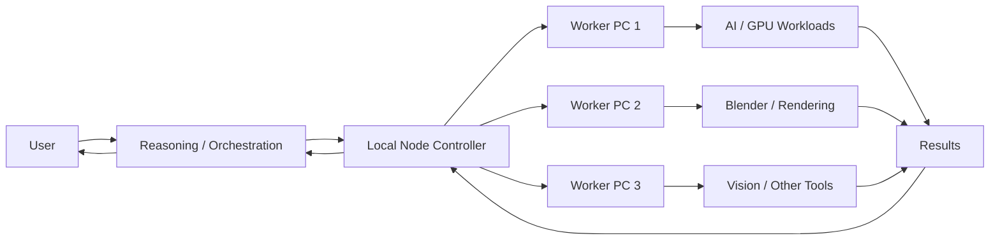

# Aubum Local Node Architecture

Aubum Local Node coordinates AI and compute workloads across multiple consumer PCs while keeping hardware, data, permissions, and execution under the user's control.

## High-Level Architecture



## Core Idea

The reasoning layer does not need to perform every task itself.

It can:

1. understand the requested goal;
2. determine the required capability;
3. select an appropriate worker;
4. prepare required resources;
5. dispatch the job;
6. monitor execution;
7. collect the result;
8. detect failures;
9. restore the worker to a known state;
10. return the result for the next decision.

## Controller Responsibilities

The Local Node Controller is intended to provide:

- worker discovery;
- health monitoring;
- capability reporting;
- job routing;
- GPU and resource management;
- job status tracking;
- failure detection;
- state restoration;
- logging and auditability.

## Worker Responsibilities

Workers expose only intentionally enabled capabilities.

Examples include:

- local LLM inference;
- computer vision;
- Blender automation;
- image generation;
- video generation;
- rendering;
- testing;
- development tools.

## State-Aware Execution

A typical job lifecycle:

```text
Inspect current state
        |
Reserve resources
        |
Prepare worker
        |
Execute job
        |
Collect result
        |
Validate completion
        |
Restore previous state
        |
Release resources
```

Failures should produce diagnostics and attempt safe restoration.

## Bounded Autonomy

Workers and controllers should enforce:

- allowed capabilities;
- restricted commands;
- resource limits;
- validation;
- logging;
- approval boundaries;
- recovery and rollback mechanisms.

The goal is useful automation without unrestricted machine access.

## Heterogeneous Hardware

A local network may contain:

- high-end GPU workstations;
- older gaming PCs;
- CPU-only machines;
- different GPU generations;
- machines dedicated to particular workloads.

Workers report their capabilities so the controller can choose an appropriate system.

## Local-First Design

The core system should remain useful using user-owned hardware without requiring permanent dependence on a cloud provider.

## Current Status

The private Aubum prototype has already been used for:

- multi-machine job execution;
- remote Blender automation;
- GPU workload switching;
- worker-state restoration;
- vision workflows;
- image and video workflows;
- automated testing;
- guarded system actions.

The public project is separating reusable infrastructure from that private environment.

## Public Development Goals

1. Define a clean worker/controller protocol.
2. Build reproducible worker installation.
3. Add resource and capability discovery.
4. Implement reliable job dispatch.
5. Add state management and restoration.
6. Add failure recovery.
7. Add logging and auditing.
8. Add bounded execution controls.
9. Test different consumer hardware.
10. Publish deployment documentation.
