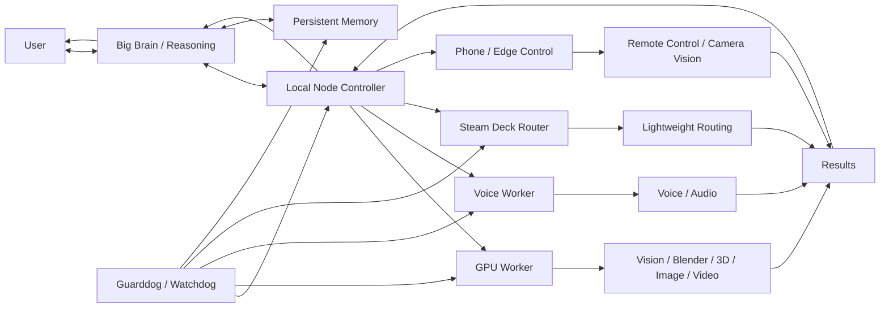

# Aubum Local Node Architecture

Aubum Local Node coordinates AI, compute, memory, monitoring, and specialized workloads across heterogeneous consumer devices while keeping hardware, data, permissions, and execution under the user's control.

The project is based on lessons from Aubum, a working private local-AI system that distributes different responsibilities across multiple machines instead of trying to make one computer perform every role.

## High-Level Architecture


```mermaid
flowchart LR
    U["User"] <--> B["Big Brain / Reasoning"]

    B <--> C["Local Node Controller"]
    B <--> M["Persistent Memory"]

    C --> H["GPU Worker"]
    C --> V["Voice Worker"]
    C --> D["Steam Deck Router"]
    C --> P["Phone / Edge Control"]

    H --> G1["Vision / Blender / 3D / Image / Video"]
    V --> G2["Voice / Audio"]
    D --> G3["Lightweight Routing"]
    P --> G4["Remote Control / Camera Vision"]

    W["Guarddog / Watchdog"] --> C
    W --> H
    W --> V
    W --> D
    W --> M

    G1 --> R["Results"]
    G2 --> R
    G3 --> R
    G4 --> R

    R --> C
    C --> B
    B --> U
```

## Core Idea

The reasoning layer does not need to perform every task itself.

It can:

1. understand the requested goal;
2. determine the required capability;
3. select an appropriate worker;
4. prepare required resources;
5. dispatch the job;
6. monitor execution;
7. collect and validate the result;
8. detect failures;
9. restore the worker to a known state;
10. preserve useful state or memory;
11. return the result for the next decision.

The system favors specialization rather than duplicating the same large model or workload on every device.

## Current Private Deployment

The private Aubum prototype currently operates across a heterogeneous seven-device environment.

### MAIN PC

Primary responsibilities:

- Big Brain / reasoning through CUDA-accelerated llama.cpp inference;
- orchestration;
- Open WebUI;
- system control;
- health-check aggregation;
- tool coordination.

MAIN remains the primary reasoning node rather than distributing independent copies of the main reasoning model across every machine.

### GPU Worker

A dedicated high-end GPU workstation handles workloads including:

- computer vision;
- Blender automation;
- 3D generation;
- image generation;
- video generation;
- rendering;
- other GPU-heavy tasks.

The worker uses managed workload modes so incompatible GPU services do not need to remain loaded simultaneously.

The controller tracks the active mode and restores the worker to the appropriate state after jobs.

### Voice Worker

A separate GPU-equipped PC is dedicated to:

- text-to-speech;
- voice processing;
- audio workloads.

Keeping voice separate allows conversational or audio services to remain available without competing with the primary reasoning or graphics workloads.

### Steam Deck Router

A Steam Deck operates as a lightweight routing node using a small local model with Vulkan acceleration.

Its role is to perform inexpensive routing and classification work without consuming the primary Big Brain or high-end GPU workers.

In the current private deployment, Open WebUI sends model traffic through a local Sentinel. The Sentinel can keep simple user requests and Open WebUI housekeeping on the Steam Deck path, while complex requests are forwarded to a Gatekeeper that wakes the primary 27B model only when required. The Gatekeeper tracks active work and unloads the Big Brain after an idle timeout so MAIN's RTX 4090 VRAM is not occupied unnecessarily.

### Medium Brain Worker

A dedicated GTX 1080 Ti system now provides an intermediate reasoning tier between the lightweight router and the primary 27B Big Brain.

Current verified configuration:

- Qwen3.5 9B-class Q6_K GGUF;
- CUDA-accelerated llama.cpp inference;
- 16K context;
- approximately 34.3 tok/s generation in the verified benchmark;
- production routing for multi-turn conversational/contextual requests that do not require the primary Big Brain.

This lets the routing layer spend more capability than the tiny router can provide without waking the most expensive reasoning model for every non-trivial conversation.

### Guarddog + Memory Laptop

A dedicated laptop provides two infrastructure roles.

#### Guarddog

Guarddog independently observes the health of major Aubum nodes and services.

Current responsibilities include monitoring:

- MAIN;
- the GPU worker;
- the Voice worker;
- the Steam Deck router;
- persistent Memory.

Guarddog is currently observation-only. Automated recovery is being introduced cautiously after normal operating behavior is characterized.

MAIN can also verify Guarddog itself, avoiding a design where the monitoring system could silently fail without detection.

#### Persistent Memory

The laptop also hosts Aubum's persistent external Memory service.

The private Memory backend remains local to the laptop.

A restricted bridge allows the Big Brain to perform approved operations such as:

- store a durable memory;
- retrieve a memory by ID;
- search memories;
- check Memory health.

Cross-machine and cross-session persistence has been verified in the private prototype.

The Big Brain can write a memory during one session and retrieve it from a fresh session later.

### Android Phone

The phone can now participate both on the local network and remotely over a private Tailscale connection.

The phone currently participates as:

- a remote control interface;
- an edge compute node;
- a recorded-video source;
- a live camera / sensor source;
- a secure remote Open WebUI/Aubum interface over cellular or other external networks.

Remote access is provided through Tailscale. Open WebUI remains bound to localhost on MAIN, while Tailscale Serve exposes a private HTTPS endpoint only to authenticated tailnet devices. This avoids opening a public inbound Open WebUI port while allowing the phone to reach Aubum away from home.

Manual Taildrop file transfer from MAIN to the phone has also been verified. Generated images can be previewed and manually downloaded from Open WebUI on mobile; automatic permanent image-transfer and retention policies remain deferred.

This allows Aubum to interact with the system away from the primary desktop while also providing visual input for vision workflows.

## Visual Observation and Evidence Continuity

The private prototype separates **camera vision** from **desktop vision** rather than treating every request containing the word "watch" as the same capability.

Current routing intent:

- **camera / phone / mobile / webcam / S25** → bounded live camera observation;
- **display / monitor / desktop / screen / window** → direct desktop observation;
- short screen-view requests use a bounded multi-frame inspection;
- longer requests use condition-aware visual supervision.

A desktop supervision cycle can:

1. capture a selected display directly;
2. sample multiple frames over a bounded interval;
3. classify whether meaningful progress or change occurred;
4. stop when the user-requested visual condition is satisfied;
5. save the relevant frames and contact sheet;
6. expose those evidence paths for later reinspection;
7. let the vision worker answer follow-up questions from the saved evidence rather than requiring a new screenshot.

This creates visual continuity across turns while preserving a known-good observation-only baseline. Memory writes and corrective actions remain separately gated.

## Controller Responsibilities

The Local Node Controller is intended to provide:

- worker discovery;
- health monitoring;
- capability reporting;
- job routing;
- GPU and resource management;
- job status tracking;
- failure detection;
- state restoration;
- persistent-state coordination;
- logging and auditability.

## Worker Responsibilities

Workers expose only intentionally enabled capabilities.

Examples include:

- local LLM inference;
- computer vision;
- Blender automation;
- 3D generation;
- image generation;
- video generation;
- rendering;
- voice and audio processing;
- lightweight routing;
- persistent memory;
- testing;
- development tools;
- PDF/document text extraction and ingestion.

Not every worker needs every capability.

Aubum intentionally assigns specialized roles to different hardware.

## Inference Acceleration and Document Ingestion

The private MAIN deployment uses a CUDA-enabled llama.cpp build for the primary 27B reasoning model on an RTX 4090.

A verified backend comparison on the same model and hardware measured approximately:

- **5.71 tok/s** generation with the earlier Vulkan path;
- **42.57 tok/s** generation with CUDA;
- **919.5 tok/s** prompt processing before the CUDA migration;
- **2775.6 tok/s** prompt processing after the CUDA migration.

The CUDA path therefore improved measured generation throughput by about **7.5x** and prompt processing by about **3x** while preserving the existing 32K-context production configuration.

The private prototype also includes a document-ingestion path for PDF files. PDF text can be extracted locally and passed into the reasoning workflow so document analysis does not depend on the user manually copying text into chat.

## On-Demand Reasoning Path

The private prototype now separates inexpensive classification/routing work from expensive primary-model inference.

```text
Open WebUI
    |
    v
Sentinel
  |          |             \
SMALL      MEDIUM           BIG
  |          |               |
Steam Deck  Dedicated        Gatekeeper
Qwen3-1.7B  9B CUDA node         |
             |                   v
             |             wake primary 27B
             |                   |
             +------ answer -----+
                                 |
                       idle timeout -> unload
```

The production path is designed so that model discovery, health checks, and known Open WebUI housekeeping requests do not wake the Big Brain. Simple work can stay on the lightweight route, conversational/contextual work can use the dedicated Medium Brain, and hard or explicitly complex work can escalate through Gatekeeper. Duplicate-launch protection and active-request protection prevent unnecessary parallel loads or premature sleep.

Production verification passed all three routes: SMALL, MEDIUM, and BIG.

This is an example of resource-aware orchestration: the routing layer decides not only *where* work should run, but whether a high-cost model should be resident in GPU memory at all.

### Conversational resource control

The current private implementation also exposes a small control surface through chat.

`status` is intercepted locally by Sentinel and reports routing state without requiring Big Brain inference.

`sleep` is also intercepted locally, but Sentinel does not directly terminate the model. Instead it calls a local Gatekeeper control endpoint. Gatekeeper then applies the same request-safety checks used by automatic idle sleep before invoking the existing Big Brain shutdown path.

This keeps conversational convenience separate from resource ownership: Sentinel recognizes the command, while Gatekeeper remains authoritative for whether the primary model may safely unload.

### Web research path

Open WebUI web search is enabled in the private deployment for current-information requests. Verified search responses can include citations, and a fresh web-research request can wake the primary 27B reasoning model for synthesis while preserving the normal idle-unload behavior afterward.

## State-Aware Execution

A typical job lifecycle:

```text
Inspect current state
        |
Determine required capability
        |
Select worker
        |
Reserve resources
        |
Prepare worker
        |
Execute job
        |
Collect result
        |
Validate completion
        |
Store useful durable state
        |
Restore previous worker state
        |
Release resources
```

Failures should produce diagnostics and attempt safe restoration without unnecessarily disturbing healthy services.

## Persistent Memory

Persistent Memory is treated as infrastructure rather than merely conversation history.

Useful durable information may include:

- verified architecture facts;
- known-good component versions;
- important project decisions;
- proven fixes;
- milestones;
- worker and capability information.

The current private prototype supports explicit memory storage and retrieval.

Automatic relevance-based retrieval and selective automatic memory writing remain active development areas.

## Independent Monitoring

A distributed system should not rely entirely on the system being monitored to determine whether it is healthy.

The private prototype therefore uses an independent Guarddog node to observe other Aubum components.

The primary node can, in turn, verify the Guarddog node.

This creates a basic reciprocal health model:

```text
Guarddog watches Aubum services
        |
        v
MAIN checks Guarddog
        |
        v
Guarddog checks local Memory
```

Health Check v0.6 verifies the distributed services, the secure remote-mobile boundary, and the dedicated Medium Brain. Its checks cover the Tailscale service/client, active tailnet connection, tailnet-only Serve configuration, localhost-only Open WebUI binding, local HTTP response, Medium Brain TCP reachability, and the Medium Brain model/API endpoint. The phone itself is not required to be online for infrastructure health.

A verified v0.6 run completed with **30 PASS / 0 WARN / 0 FAIL**.

The checker remains read-only. It also recognizes the primary Big Brain's intentionally asleep state as healthy when Gatekeeper reports that expected state, so normal on-demand GPU power management is not treated as a failure.

Future work will add carefully bounded recovery actions after repeated failures are confirmed.

## Bounded Autonomy

Workers and controllers should enforce:

- allowed capabilities;
- restricted commands;
- resource limits;
- validation;
- logging;
- approval boundaries;
- recovery and rollback mechanisms;
- network-access boundaries;
- minimum necessary permissions.

The goal is useful automation without unrestricted machine access.

## Heterogeneous Hardware

A local network may contain:

- high-end GPU workstations;
- older gaming PCs;
- laptops;
- handheld gaming hardware;
- mobile devices;
- CPU-only machines;
- different GPU vendors and generations;
- machines dedicated to particular workloads.

Workers report their capabilities so the controller can choose an appropriate system rather than requiring identical hardware.

## Secure Remote Access

The private deployment extends local-first operation with a private remote-access layer rather than directly exposing local services to the public internet.

Current verified path:

```text
Android phone on cellular
        |
        v
Private Tailscale network
        |
        v
Tailscale Serve HTTPS endpoint
        |
        v
Open WebUI on MAIN
(bound to localhost)
        |
        v
Aubum routing / tools / Big Brain
```

The phone was verified to use Open WebUI over cellular with Wi-Fi disabled. The local Open WebUI service remains localhost-bound, and the remote HTTPS endpoint is restricted to the tailnet.

This keeps the local service boundary intact while adding remote usability.

## Local-First Design

The core system should remain useful using user-owned hardware without requiring permanent dependence on a cloud provider.

Models, memory, workload execution, and orchestration can remain local while cloud services may optionally supplement the system where useful.

## Current Status

The private Aubum prototype has already demonstrated:

- multi-machine job execution;
- centralized worker control;
- managed GPU workload switching;
- previous-state restoration;
- remote Blender automation;
- vision workflows;
- image and video workflows;
- 3D-generation tooling;
- dedicated voice workloads;
- lightweight model-based routing;
- production three-tier SMALL / MEDIUM / BIG routing;
- dedicated CUDA-accelerated 9B Medium Brain inference;
- CUDA-accelerated primary-model inference;
- PDF/document text extraction and reading;
- phone-based control;
- secure remote mobile access over cellular through a private tailnet;
- live and recorded video input;
- direct desktop monitor observation;
- condition-aware visual task supervision;
- saved visual evidence and follow-up reinspection;
- independent system monitoring;
- cross-machine persistent memory;
- cross-session memory retrieval;
- automated health checking, including secure remote-mobile boundary checks;
- guarded system actions;
- live web research with source citations;
- local chat status/sleep resource controls.

The public project is separating reusable infrastructure from that private environment.

Private deployment details, credentials, machine-specific configuration, and unrelated Aubum components are not automatically part of the public project.

## Public Development Goals

1. Define a clean worker/controller protocol.
2. Build reproducible worker installation.
3. Add resource and capability discovery.
4. Implement reliable job dispatch.
5. Add state management and restoration.
6. Add failure detection and bounded recovery.
7. Add logging and auditing.
8. Add persistent-state and memory interfaces.
9. Add bounded execution controls.
10. Test heterogeneous consumer hardware.
11. Simplify deployment for non-expert users.
12. Publish complete deployment documentation.

## Development Principle

Known-good working components should not be replaced merely for architectural cleanliness.

New capabilities should be developed alongside verified baselines, tested independently, and promoted only after they demonstrate equivalent or better reliability.
